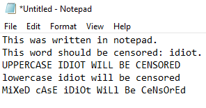
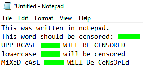

# ocr-word-censor

### A small script that I made to do the screenshot censoring work for me.

I found that sometimes I would miss names when censoring screenshots, so I figured that it would be useful to have a computer to the double checking for me. This program will go through the screenshot that you give it and censors any matches that are found.

## Warnings:

- This program seems to work so-so on computer screenshots, due to their low quality and very antialiased state. High quality phone screenshots are what the program best works on. It was tested using my Pixel 4A and there were no errors encountered, however on my PC it only worked about 2/3 times.

- This program is not a substitute for actually scanning sensitive documents. If censoring really matters, then do it yourself, or using a better tool.

## Installation:

`sudo apt install tesseract-ocr python3 python3-pip`

`pip3 install -r requirements.txt`

## Usage:

`python3 ./censor.py -i [INPUT] -o [OUTPUT] -w [WORD] -c [COLOR]`

Example (censors all "idiot"s in the screenshot with green):

`python3 ./censor.py -i ./SCREENSHOT_1234567890.png -o output.png -w "idiot" -c "#00ff00"`

